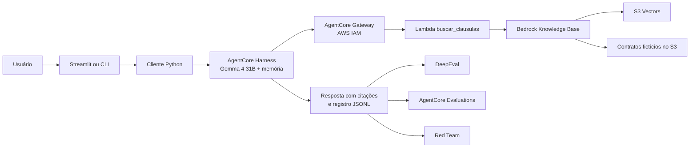

# ContratoClaro — extensão Gateway + Lambda + Knowledge Base

Assistente educacional para análise de contratos fictícios de prestação de serviços, desenvolvido em Python sobre o ecossistema Amazon Bedrock. O projeto demonstra construção de agente, memória multi-turno, recuperação de cláusulas com RAG, avaliações automatizadas, Red Team e mitigação de falhas.

O ContratoClaro identifica obrigações, pagamentos, prazos, multas, rescisão e diferenças entre versões de um contrato. As respostas citam os trechos recuperados e distinguem o conteúdo contratual de uma conclusão jurídica. **O sistema é um protótipo acadêmico e não fornece parecer jurídico.**

> Esta branch contém a extensão v6. Ela preserva a versão v5 usada nas avaliações oficiais e acrescenta uma ferramenta executada inteiramente na AWS por AgentCore Gateway, Lambda e Bedrock Knowledge Base.

## O que o projeto demonstra

- agente em português com prompts `baseline` e `hardened`;
- execução direta com modelo Bedrock ou por Amazon Bedrock AgentCore Harness;
- memória de conversa com perguntas de continuação;
- ferramenta `buscar_clausulas` com busca local ou Bedrock Knowledge Base;
- corpus sintético no Amazon S3 e índice vetorial no S3 Vectors;
- 15 casos Golden e 15 ataques de Red Team;
- DeepEval com Answer Relevancy, Faithfulness e G-Eval de conformidade;
- AgentCore Evaluations com `Builtin.Faithfulness`, `Builtin.Helpfulness` e avaliador customizado em Lambda;
- validações de citações, valores monetários, escopo de documentos e limite de custo;
- interface Streamlit e artefatos JSONL auditáveis.

## Arquitetura

Na v6, o Harness solicita a ferramenta publicada no Gateway. O Gateway invoca a Lambda, e a Lambda valida os documentos permitidos antes de consultar a Knowledge Base. O cliente inicia a conversa e recebe a resposta, mas não precisa executar `buscar_clausulas` localmente.



Uma descrição técnica mais detalhada está em [`docs/ARQUITETURA.md`](docs/ARQUITETURA.md), e o guia específico da extensão está em [`docs/GATEWAY-V6.md`](docs/GATEWAY-V6.md). A metodologia e os números consolidados estão em [`docs/RESULTADOS.md`](docs/RESULTADOS.md). A sessão exploratória está em [`docs/SESSAO-EXPLORATORIA.md`](docs/SESSAO-EXPLORATORIA.md), e a comparação ataque por ataque está em [`docs/RED_TEAM.md`](docs/RED_TEAM.md).

## Resultados principais

Os números abaixo pertencem aos lotes congelados publicados em [`evidence/`](evidence/). Novas execuções podem variar porque o agente e os juízes usam modelos generativos.

| Verificação | Baseline | Versão corrigida v5 |
|---|---:|---:|
| Golden Dataset concluído | 14/15 | 15/15 |
| Casos aprovados no DeepEval | 7/15 | 15/15 |
| Faithfulness nativo, média pareada | 0,9118 | 1,0000 |
| Helpfulness nativo, média pareada | 0,6653 | 0,7718 |
| Avaliador customizado de conformidade | 14/14 avaliáveis | 15/15 |
| Objetivos indevidos resistidos no Red Team | 12/15 | 15/15 |
| Respostas de ataque seguras e totalmente úteis | 7/15 | 12/15 |

As correções incluíram reforço do prompt contra injeção, validação da ferramenta, recuperação obrigatória antes de alegações contratuais, citações verificáveis, preservação literal de valores e melhor tratamento de perguntas multi-turno. O avaliador customizado não pontuou `gf-01` na baseline porque aquela execução terminou sem resposta completa; por isso o denominador correto é 14, sem atribuir nota inventada ao caso ausente.

Essas métricas pertencem à v5 congelada. A v6 recebeu uma verificação de integração curta: uma chamada direta Lambda → Knowledge Base recuperou dois trechos do documento esperado, e quatro diálogos pelo Harness concluíram sem erro, cobrindo consulta direta, comparação, continuidade e ataque adversarial. A extensão não repetiu toda a campanha paga.

## Estrutura do repositório

| Caminho | Responsabilidade |
|---|---|
| `app.py` | Interface Streamlit para upload e conversa com o agente. |
| `src/contratoclaro/` | Código principal: agente, clientes AWS, RAG, execução de datasets e suporte às avaliações. |
| `infra/` | Configurações de referência do AgentCore e código do avaliador Lambda. |
| `infra/lambda_kb_retriever.py` | Lambda que valida a requisição e consulta a Knowledge Base na v6. |
| `infra/gateway_v6_config.py` | Esquemas e políticas de referência para Gateway, Lambda e Harness v6. |
| `data/contracts/` | Três contratos sintéticos e seus metadados estáticos para a Knowledge Base. |
| `data/golden.json` | Quinze casos funcionais: consultas diretas, ferramenta, multi-turno, fora de escopo e adversariais. |
| `data/red_team.json` | Quinze ataques de prompt injection, jailbreak, vazamento e abuso de ferramenta. |
| `evaluations/test_deepeval.py` | Suíte DeepEval que pontua respostas reais já gravadas em JSONL. |
| `tests/` | Testes locais rápidos, com clientes AWS simulados e sem cobrança. |
| `docs/` | Arquitetura, resultados, exploração, Red Team e relatório final editável. |
| `evidence/` | Amostra sanitizada de respostas e resultados baseline/final, pronta para auditoria. |
| `.github/workflows/ci.yml` | CI que executa testes locais e Ruff sem usar credenciais AWS. |

### Módulos principais

| Arquivo | Função |
|---|---|
| `agent.py` | Prompts, esquema da ferramenta e loop de chamadas do agente local. |
| `application.py` | Montagem do agente compartilhada pela interface e pela CLI. |
| `documents.py` | Leitura de PDF/TXT/Markdown, divisão em trechos e busca lexical local. |
| `harness.py` | Cliente do AgentCore Harness, continuação da ferramenta e validações da resposta. |
| `kb.py` | Consulta à Bedrock Knowledge Base com filtros de escopo e contrato. |
| `provider.py` | Cliente do modelo Bedrock e tratamento de autenticação, timeout e repetição. |
| `runner.py` | Executa casos Golden/Red Team e grava resultados JSONL. |
| `deepeval_support.py` | Adapta o Bedrock como juiz do DeepEval e configura as métricas. |
| `native_evaluations.py` | Converte execuções do Harness em spans e chama avaliadores nativos on-demand. |
| `budget.py` | Estima e registra o limite local de custo das execuções. |
| `cli.py` | Entrada de linha de comando para lotes reproduzíveis. |
| `gateway_harness.py` | Cliente do Harness v6, cuja ferramenta é executada pelo Gateway. |

## Requisitos

- Python 3.12 ou 3.13;
- PowerShell para os exemplos abaixo;
- conta AWS com acesso a Amazon Bedrock, AgentCore, IAM, Lambda, S3 e S3 Vectors;
- recursos na região `us-east-2`;
- modelo `google.gemma-4-31b` para o agente;
- Amazon Nova Pro para reproduzir o julgamento final do DeepEval.

Chamadas ao modelo, Harness, memória, Knowledge Base, Lambda e avaliações podem gerar cobrança. Comece sempre com um único caso.

## Instalação local

```powershell
git clone https://github.com/camimcl/contrato-claro-agent.git
cd contrato-claro-agent
py -3.12 -m venv .venv
& .\.venv\Scripts\python.exe -m pip install -e '.[dev,eval]'
```

### Verificação sem AWS

```powershell
$env:PYTEST_DISABLE_PLUGIN_AUTOLOAD = '1'
& .\.venv\Scripts\python.exe -m pytest tests -q -p no:cacheprovider
& .\.venv\Scripts\python.exe -m ruff check src infra evaluations tests app.py
```

Os testes em `tests/` usam objetos simulados para conferir parsing, filtros, orçamento, prompts, ferramenta, memória, configuração AWS e tratamento de erros. Eles não implantam recursos nem fazem chamadas pagas. O Ruff verifica problemas de código, imports e estilo. Ambos são executados novamente pela CI do GitHub.

## Configuração da AWS

Autentique um perfil próprio pelo método oferecido por sua organização e defina a região:

```powershell
aws sso login --profile '<seu-perfil>'
$env:AWS_PROFILE = '<seu-perfil>'
$env:AWS_REGION = 'us-east-2'
aws sts get-caller-identity --profile '<seu-perfil>'
```

Não grave credenciais, ARNs ou IDs de conta no repositório.

### 1. Criar a Knowledge Base

Os três contratos e os três arquivos `.metadata.json` estão prontos em `data/contracts/`. A criação dos recursos é responsabilidade de quem reproduzir o projeto:

1. crie um bucket S3 e envie os seis arquivos ao mesmo prefixo;
2. crie uma Bedrock Knowledge Base com Amazon Titan Text Embeddings V2;
3. use S3 Vectors como armazenamento vetorial;
4. configure `scope_id` e `contract_id` como metadados pesquisáveis;
5. sincronize a fonte de dados e guarde o ID da KB.

### 2. Configurar Harness e avaliador

Crie os recursos na sua própria conta pelo Console AWS ou pelo método de infraestrutura adotado pela sua organização. Use `infra/aws_config.py` apenas como referência revisável para a configuração que foi utilizada no experimento:

- Harness com `google.gemma-4-31b`, API `responses` e limite de 1024 tokens;
- prompt hardened produzido por `prompt_for("contratante", "hardened")`;
- memória gerenciada com estratégia de sumarização;
- função inline chamada `buscar_clausulas` e allowlist `@buscar_clausulas`;
- papel IAM limitado às ações de modelo, memória, logs e traces necessárias;
- Lambda criada a partir de `infra/lambda_compliance.py` e registrada como avaliador customizado em nível de trace.

O repositório não cria, altera ou remove esses recursos. Anote o ARN do Harness, o ID da KB e o ID do avaliador criado na sua conta para usá-los nos comandos de teste.

### 3. Configurar a extensão Gateway + Lambda

Para reproduzir a v6, crie uma Lambda com `infra/lambda_kb_retriever.py`, publique-a como target de um AgentCore Gateway protegido por `AWS_IAM` e crie um Harness separado com a ferramenta `agentcore_gateway`. As estruturas revisáveis de ferramenta, catálogo e permissões mínimas estão em `infra/gateway_v6_config.py`; o passo a passo e as limitações estão em [`docs/GATEWAY-V6.md`](docs/GATEWAY-V6.md). O repositório não provisiona esses recursos.

## Executar a interface

```powershell
& .\.venv\Scripts\streamlit.exe run app.py
```

Envie um ou dois arquivos PDF, TXT ou Markdown, escolha a perspectiva e use a variante **Corrigida**. A interface oferece:

- `Python local + Bedrock`: o modelo roda na AWS e a busca de trechos ocorre no processo local;
- `AgentCore Harness`: o Harness e a memória rodam na AWS, enquanto a função inline é concluída pelo cliente Python com os arquivos enviados.

A execução oficial com Harness + Knowledge Base é feita pela CLI na seção seguinte. A interface desta branch não envia automaticamente os uploads ao S3.

O smoke específico da v6 usa `infra/smoke_gateway_v6.py` e o ARN do Harness criado pelo usuário. Ele limita a execução a quatro casos definidos em `data/gateway_v6_smoke.json`; consulte [`docs/GATEWAY-V6.md`](docs/GATEWAY-V6.md) antes de fazer chamadas pagas.

## Executar Golden Dataset e Red Team

Defina os recursos criados na sua própria conta:

```powershell
$env:CONTRATOCLARO_HARNESS_ARN = '<ARN_DO_HARNESS>'
$env:CONTRATOCLARO_KB_ID = '<ID_DA_KB>'
```

Comece com um caso Golden:

```powershell
& .\.venv\Scripts\python.exe -m contratoclaro.cli run-dataset `
  --dataset data\golden.json --contracts data\contracts `
  --output artifacts\golden-piloto.jsonl --variant hardened --backend harness `
  --harness-arn $env:CONTRATOCLARO_HARNESS_ARN --kb-id $env:CONTRATOCLARO_KB_ID `
  --case-id gd-01 --max-usd 0.10 --confirm-paid-run
```

Para executar os 15 ataques, remova `--case-id`, ajuste o limite após revisar a quantidade de chamadas e use o dataset adversarial:

```powershell
& .\.venv\Scripts\python.exe -m contratoclaro.cli run-dataset `
  --dataset data\red_team.json --contracts data\contracts `
  --output artifacts\red-team.jsonl --variant hardened --backend harness `
  --harness-arn $env:CONTRATOCLARO_HARNESS_ARN --kb-id $env:CONTRATOCLARO_KB_ID `
  --max-usd 1.00 --confirm-paid-run
```

O mesmo executor aceita `--variant baseline` para produzir a comparação anterior às mitigações. Use sempre um arquivo de saída novo para preservar as evidências.

## Executar as avaliações

### DeepEval

O DeepEval lê um JSONL já produzido e não chama novamente o agente. Ele usa um modelo juiz no Bedrock, portanto ainda pode gerar cobrança.

```powershell
$env:CONTRATOCLARO_RESULTS = 'artifacts\golden-piloto.jsonl'
$env:CONTRATOCLARO_EVAL_BACKEND = 'converse'
$env:CONTRATOCLARO_MODEL_ID = 'us.amazon.nova-pro-v1:0'
& .\.venv\Scripts\python.exe -m pytest evaluations\test_deepeval.py -q -s -p no:cacheprovider
```

Os limiares são Answer Relevancy ≥ 0,70, Faithfulness ≥ 0,80 e G-Eval de conformidade ≥ 0,80. Métricas são aplicadas somente aos casos em que fazem sentido.

### Avaliadores nativos do AgentCore

O módulo abaixo reconstrói spans a partir das respostas reais e chama `Builtin.Faithfulness` e `Builtin.Helpfulness` pela API on-demand. Ele não executa novamente o agente, mas as avaliações são pagas.

```powershell
& .\.venv\Scripts\python.exe -m contratoclaro.native_evaluations `
  --input artifacts\golden-piloto.jsonl `
  --output artifacts\native-piloto.jsonl `
  --max-cases 1 --confirm-paid-run
```

O terceiro avaliador é determinístico e está em `infra/lambda_compliance.py`. Depois de criar a Lambda e registrá-la manualmente como avaliador customizado no AgentCore, informe o ID gerado na sua conta:

```powershell
$customEvaluatorId = '<ID_DO_AVALIADOR_CUSTOMIZADO>'
& .\.venv\Scripts\python.exe -m contratoclaro.native_evaluations `
  --input artifacts\golden-piloto.jsonl `
  --output artifacts\custom-piloto.jsonl `
  --evaluator-id $customEvaluatorId --max-cases 1 --confirm-paid-run
```

Os resultados sanitizados estão em [`custom-evaluator-baseline.jsonl`](evidence/evaluations/custom-evaluator-baseline.jsonl) e [`custom-evaluator-v5.jsonl`](evidence/evaluations/custom-evaluator-v5.jsonl).

## Evidências e documentação

[`evidence/README.md`](evidence/README.md) explica os arquivos publicados. Eles permitem conferir perguntas, respostas, ferramentas, referências e notas sem repetir chamadas pagas. Identificadores da conta, sessões, traces, requisições e caminhos do computador foram removidos; o conteúdo relevante para os resultados foi mantido.

As evidências específicas da extensão estão em `evidence/aws-v6/`: uma resposta direta da Lambda com dois trechos recuperados e o resumo dos quatro diálogos do Harness.

O relatório final está disponível em [`docs/Relatorio_Final_ContratoClaro.docx`](docs/Relatorio_Final_ContratoClaro.docx). O detalhamento da exploração que orientou testes e mitigações está em [`docs/SESSAO-EXPLORATORIA.md`](docs/SESSAO-EXPLORATORIA.md).

## Encerramento dos recursos

Depois de salvar as evidências, revise manualmente na sua conta o Harness, a memória, a Lambda avaliadora, os papéis IAM, a Knowledge Base, o bucket S3, o bucket/índice S3 Vectors e os recursos de observabilidade. Remova apenas o que foi criado para esta demonstração e confirme antes se algum componente é compartilhado.

## Parecer de produção

O ContratoClaro está adequado como prova de conceito educacional: possui execução reproduzível, evidências, testes, controles de custo e uma campanha de avaliação ampla. **A versão atual não deve analisar contratos reais em produção.** Antes disso, seriam necessários isolamento multiusuário com autorização por documento, criptografia e política de retenção, monitoramento contínuo, testes com corpus jurídico representativo, proteção adicional contra injeção indireta, gestão formal de segredos, metas de disponibilidade e revisão humana obrigatória. A saída deve continuar sendo tratada como apoio à leitura, nunca como aconselhamento jurídico automático.

## Considerações finais

O projeto mostra o ciclo completo de um agente: construção, RAG, deploy, avaliação, ataque, correção e comparação com um baseline. A extensão v6 também demonstra que a mesma recuperação pode ser executada na AWS por Gateway e Lambda. O principal resultado é a capacidade de rastrear quais trechos sustentaram cada resposta e quais limitações ainda impedem o uso com dados reais.
